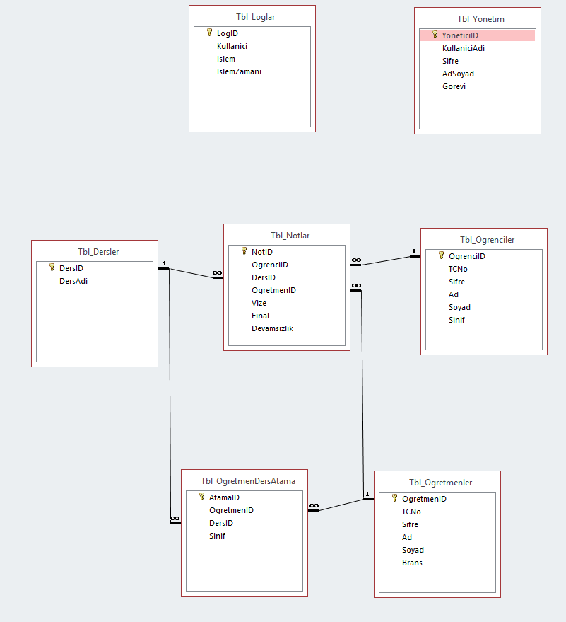
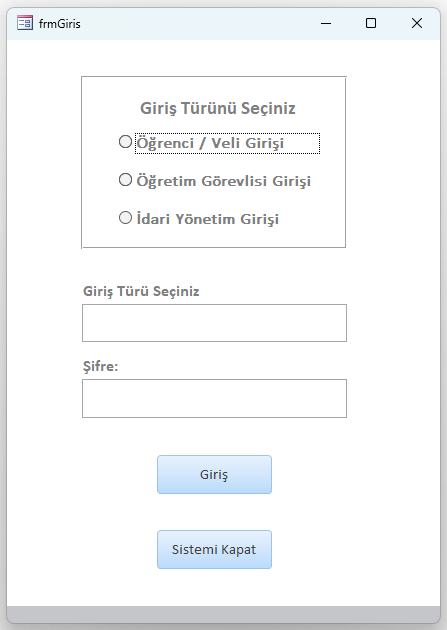
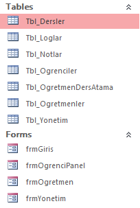

# Proje Özeti
MS Access Veritabanı kullanılarak oluşturulmuş öğrenci takip sistemi programı. 

# Öğrenci Takip Sistemi (Student Tracking System)

Bu proje, Tokat Gaziosmanpaşa Üniversitesi Bilgisayar Programcılığı eğitimi kapsamında ilişkisel veritabanı mimarisi ve otomasyon mantığını uygulamak amacıyla Microsoft Access ve Excel entegrasyonu ile geliştirilmiş masaüstü tabanlı bir öğrenci yönetim ve takip sistemidir.

## Sistem Özellikleri
* **İlişkisel Veritabanı Mimarisi:** Tablolar arası birincil (Primary Key) ve yabancı (Foreign Key) anahtar ilişkileriyle optimize edilmiş, veri bütünlüğü (data integrity) kurallarına uygun tasarım.
* **Katmanlı Kullanıcı Yetkilendirmesi:** İdari Yönetim, Öğretim Görevlileri ve Öğrenciler için ayrı seviyelerde yapılandırılmış güvenli giriş paneli (Authentication).
* **Veri Yönetimi (CRUD):** Öğrenci kayıtları, dersler, notlar ve loglar üzerinde tam ekleme, okuma, güncelleme ve silme kabiliyetleri.
* **Otomatik Raporlama:** Öğrenci performans ve durum verilerini anlık olarak işleyen ve Excel entegrasyonu ile raporlayabilen sorgu formları.

## Önemli Sistem Gereksinimleri (Teknik Mimari)
Bu uygulamanın derleme mimarisi ve arkasındaki VBA (Visual Basic for Applications) kütüphaneleri, kararlılık ve laboratuvar standartları gereği **32-bit (x86)** altyapısına göre yapılandırılmıştır.

* **Çalıştırma Şartı:** Uygulamanın sorunsuz çalışabilmesi, OLE ve ActiveX bileşenlerinin tetiklenebilmesi için **Microsoft Access'in 32-bit (x86) sürümü** ile açılması gerekmektedir. 64-bit mimarilerde derleme hatası alınabilir.

## Kullanılan Teknolojiler
* **Veritabanı ve Arayüz:** Microsoft Access (RDBMS)
* **Veri Analizi ve Raporlama:** Microsoft Excel

## 📸 Sistem Ekran Görüntüleri ve Tasarım
Uygulamanın arayüz tasarımı ve arkasındaki veritabanı şemasına ait önizlemeler aşağıda yer almaktadır:

### 1. Veritabanı İlişki Şeması (Database Schema)
Tabloların normalizasyon kurallarına ve ilişkisel veritabanı mantığına göre birbiriyle olan bağları:

### 2. Kullanıcı Giriş Arayüzü (Login Interface)
Sistem güvenliğini sağlayan, barlardan arındırılmış temiz giriş paneli:

### 3. Veri Yönetim Paneli
Aktif öğrenci ve ders kayıtlarının izlendiği ana tablo yapıları:

## Varsayılan Test Giriş Bilgileri
Uygulamayı yerel bilgisayarınızda (32-bit Access ile) test etmek için aşağıdaki jenerik hesap bilgilerini kullanabilirsiniz:
* **Kullanıcı Adı:** `admin`
* **Şifre:** `123`

## 📄 Lisans
Bu proje MIT Lisansı ile lisanslanmıştır.
